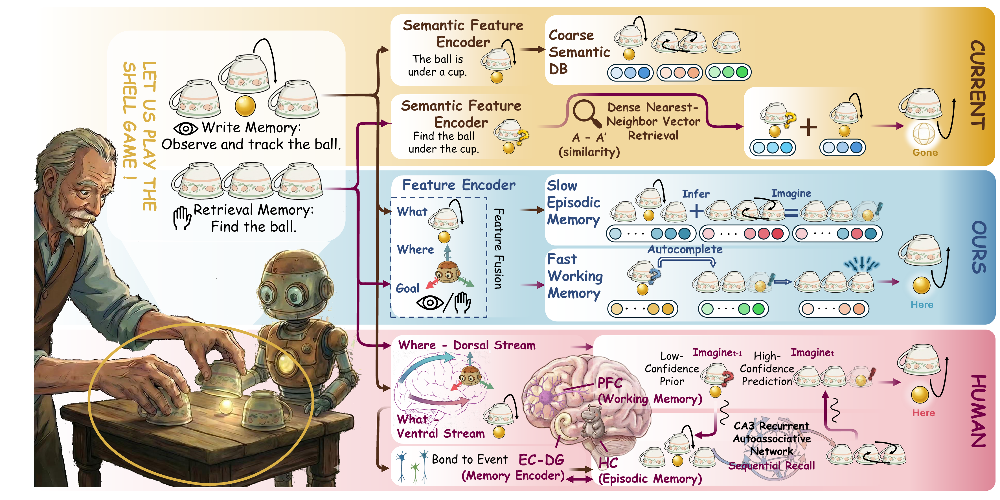
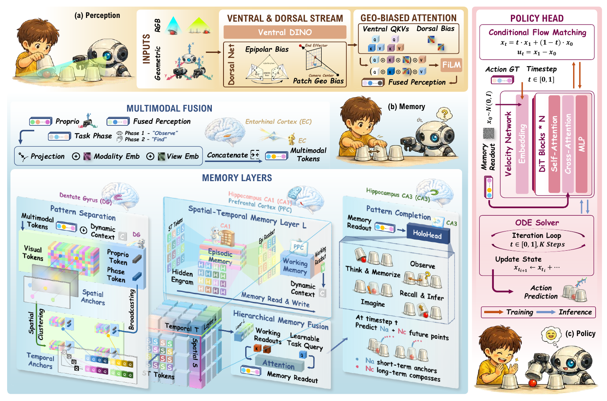

<h1 align="center">Chameleon: Episodic Memory for Long-Horizon Robotic Manipulation</h1>

  
  
  
  

  <strong>Xinying Guo</strong>1,2,‡,
  <strong>Chenxi Jiang</strong>1,‡,
  <strong>Hyun Bin Kim</strong>1,
  <strong>Ying Sun</strong>2,
  <strong>Yang Xiao</strong>1,
  <strong>Yuhang Han</strong>3,
  <strong>Jianfei Yang</strong>1,†

  1MARS Lab, Nanyang Technological University, Singapore 
  2Institute for Infocomm Research, A*STAR, Singapore 
  3National University of Singapore

  ‡Equal Contribution&nbsp;&nbsp;&nbsp;
  †Corresponding Author

  

<table align="center">
  <tr>
    <td valign="top" width="78%">
      <b>Abstract.</b> Robotic manipulation often requires memory: occlusion and state changes can make decision-time observations perceptually aliased, making action selection non-Markovian at the observation level because the same observation may arise from different interaction histories. Most embodied agents implement memory via semantically compressed traces and similarity-based retrieval, which discards disambiguating fine-grained perceptual cues and can return perceptually similar but decision-irrelevant episodes. Inspired by human episodic memory, we propose <b>Chameleon</b>, which writes geometry-grounded multimodal tokens to preserve disambiguating context and produces goal-directed recall through a differentiable memory stack. We also introduce <b>Camo-Dataset</b>, a real-robot UR5e dataset spanning episodic recall, spatial tracking, and sequential manipulation under perceptual aliasing. Across tasks, Chameleon consistently improves decision reliability and long-horizon control over strong baselines in perceptually confusable settings.
        
      
      <b>Correspondence:</b> Jianfei Yang at <a href="mailto:jianfei.yang@ntu.edu.sg">jianfei.yang@ntu.edu.sg</a>
    </td>
  </tr>
</table>

  

  <i>Code coming soon.</i>

